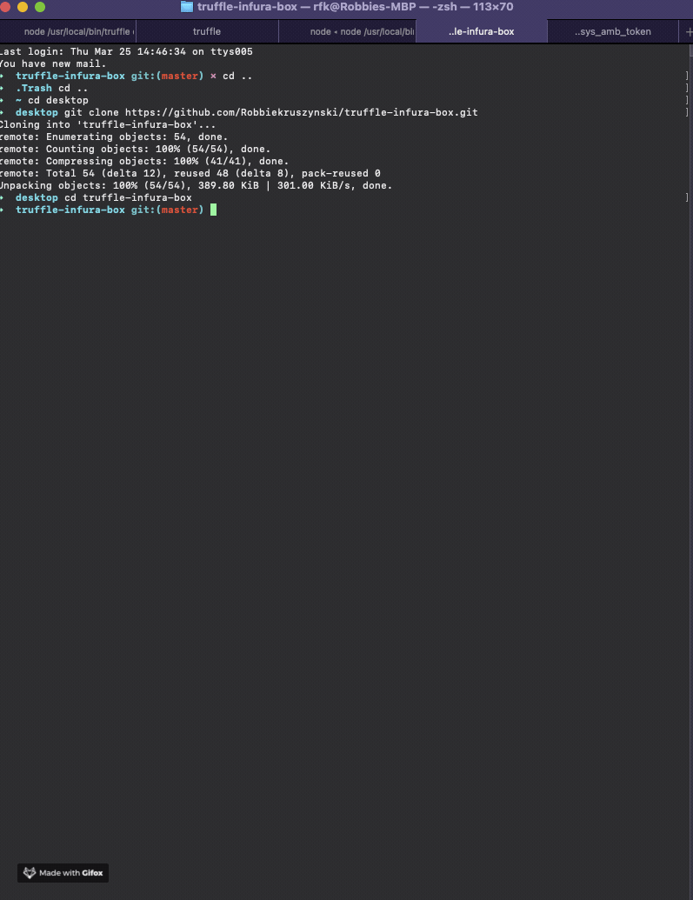
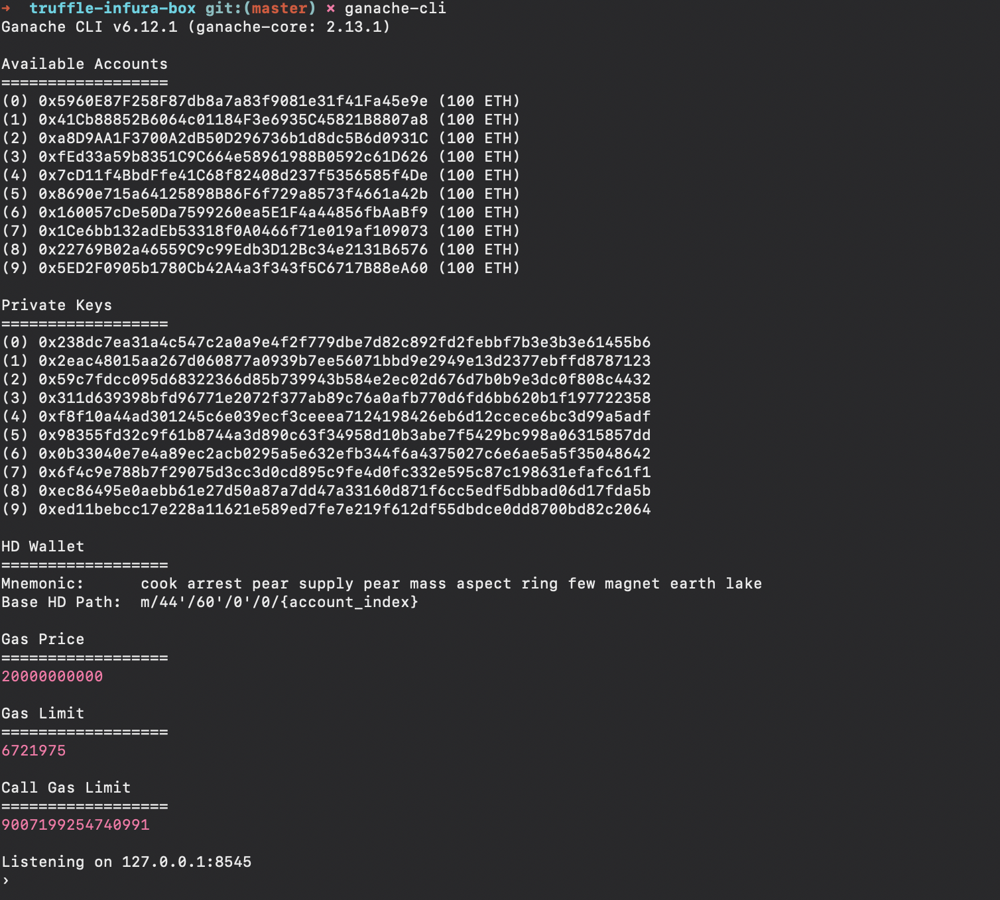
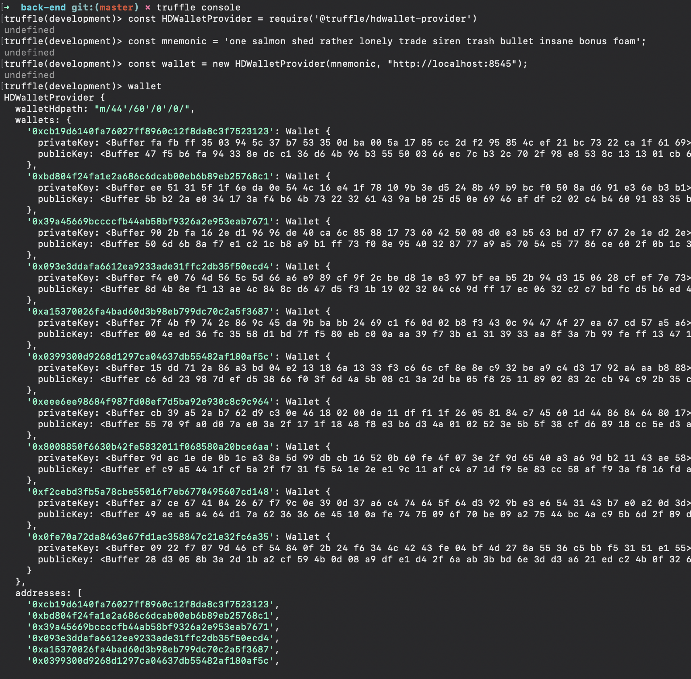
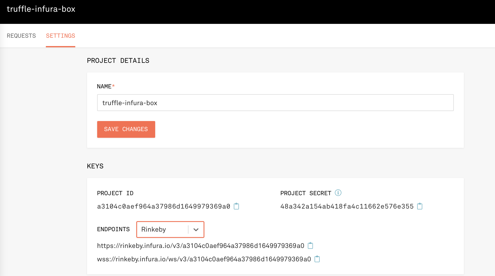
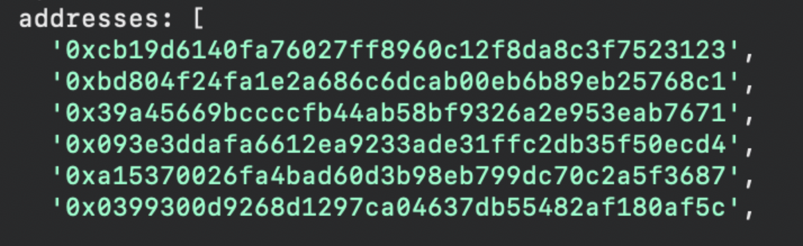
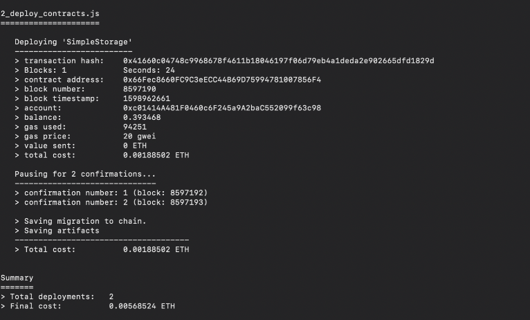
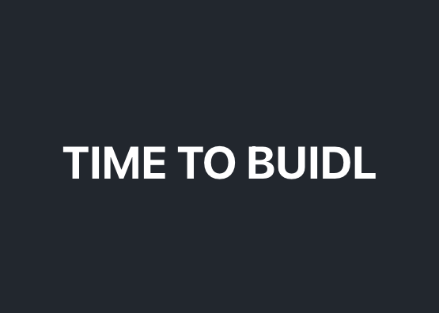

# Infura x Truffle Laboratory

This is a box that ideally gets you set up with the basic scaffolding that gives you the ability to add your own logic without having to worry about the nuts and bolts. You'll need to do a few things on your end but this should get you up and going with project that uses React + Truffle + Infura which can deploy to the rinkeby testnet ( you can of course re- configure this to deploy to another desired network).

## STACK

### TRUFFLE

link: https://www.trufflesuite.com/

### INFURA

link: https://infura.io/

Go ahead and sign up for a new account if you don't have one already

### REACT

link : https://reactjs.org/docs/getting-started.html

## Make sure you've installed

#### yarn

Firsly this requires you have yarn installed
(On the chance you don't you can find out more about it in the link below)

[https://classic.yarnpkg.com/en/docs/install/#mac-stable]

`npm install --global yarn`

Next up we will be using Wallet-enabled Web3 provider. Use it to sign transactions for addresses derived from a 12 or 24 word mnemonic.

#### HD Wallet-provider

LINK https://github.com/trufflesuite/truffle/tree/master/packages/hdwallet-provider#readme

##### We are going to use version 1.2.2 for our hdwalletprovider in this box

`npm install @truffle/hdwallet-provider@1.2.2`

#### Ganache

The GUI or CLI both work, use whichever you're more comfortable with

GUI download found here: [https://www.trufflesuite.com/ganache]

Command to install the CLI

`yarn global add ganache-cli`

#### Mnemonic Generator

if you need one here is a link
[https://iancoleman.io/bip39/]

(select 12)

# Instructions on how to use this box:

### Step 1: We will start by running the command

`yarn`

### Step 2: Next get Ganache up and running

navigate to the folder back-end

`cd back-end`

Now that your in the folder holding our truffle.config (along with other files) You can start Ganache

you can do this with the GUI or CLI (be sure your on port: 8545)

if using the CLI go ahaed and run the command

`ganache-cli`

you should now see in your terminal

Open up another tab to work out of while keeping the CLI up and running

### Step 3: Define your wallet

Next we will want to define the wallet we will be using to deploy

`truffle console`

`const HDWalletProvider = require('@truffle/hdwallet-provider');`

`const mnemonic = '12 words here';`

`const wallet = new HDWalletProvider(mnemonic, "http://localhost:8545");`

`wallet`

##### the first address you see from your newly generated wallet you'll need to fund with Rinkeby

### Step 4: Get set up with Infura

Head over to your dashboard on Infura
grab your project ID and update the secrets.json file with that ID
Remove from string.

While you are here go ahead and add the same mnemonic you used for your wallet. Keep your mnemonic in a string.

Delete the IMPORTANT NOTE that lives in the file. That is just to remind you of the important of keeping this information secure.

### Step 5: Acquire Rinkeby

If you need Rinkeby a faucet can be found here

[https://faucet.rinkeby.io/]

next make sure you fund the first address created from your

`wallet` command

in my instance it would be

0xcb19d6140fa76027ff8960c12f8da8c3f7523123

Going ahead and send that X amount of testEth, I always send 1, because it's test ETH.

### Step 7: Update and Deploy

Now that your address you're going to use to deploy is funded with Rinkeby it's time to add your logic to the YourContractHere.sol in the contract folder along with the 2_update_this.js file in the migrations folder.

Once you've added your logic you can in your terminal run

`truffle migrate --network rinkeby`

### Step 7: Tie everything together

To spin up the bones of the project run

`yarn start`

which should deploy at localhost: 3000

You have a build folder that was created when you did a compile / migrate. Pending on how many contracts you have you'll see a JSON file which contants an ABI.

You'll want to add your ABI information to the ABI folder which has an ABI file. (commented out examples live in the file)

You have ethers cooked into the project.

You have pathing for the abi cooked in.

(_import { UPDATE_THIS } from "./abi/abi";_ in App.js)

### Step 8: BUIDL

Have fun and BUIDL!
